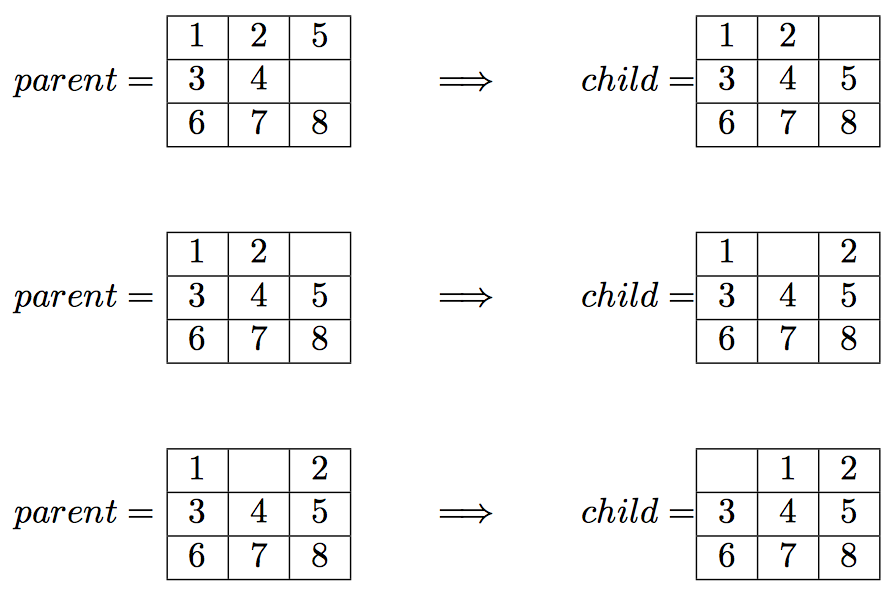

# AI-n-puzzle
<b>A solver for n-puzzle board games given an arbitrary starting configuration</b>

The N-puzzle is a sliding puzzle that consists of a board holding N = m^2 − 1 (m = 3, 4, 5, ...) distinct movable tiles, plus an empty space. The tiles are numbers from the set {1, …, m^2 − 1} and the empty space may be swapped with any tile horizontally or vertically ('Up', 'Down', 'Left', 'Right').

Given an initial state of the board, the combinatorial search problem is to find a sequence of moves that transitions this state to the goal state; that is, the configuration with all tiles arranged in ascending order ⟨0, 1, …, m^2 − 1⟩. The search space is the set of all possible states reachable from the initial state.

Three algorithms are implemented:
1. <b>Breadth-First Search</b>: Expand shallowest node; explore all neighbors at present depth of the tree before moving down (FIFO queue implementation)
2. <b>Depth-First Search</b>: Expand deepest node; explore along the current branch as deep as possible before backtracing (LIFO queue implementation)
3. <b>A-Star Search</b>: Minimize total estimated solution cost (Priority queue implementation)
